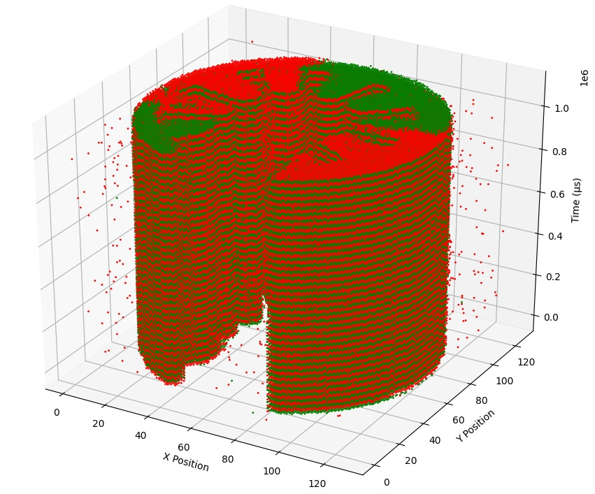
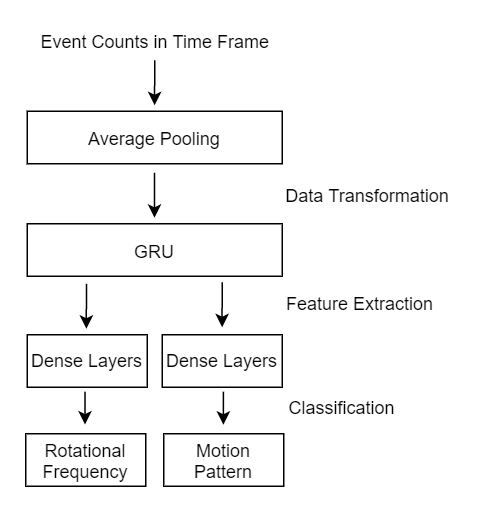
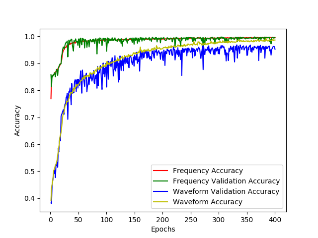

# Neuromorphic Data Processing

Python scripts for plotting and performing machine learning on neuromorphic data.

AEDAT files must first be acquired from a DVS and converted to CSV with one of two conversion programs: [AEDAT File Reader](https://github.com/MartinNowak96/AEDAT-File-Reader) or [AEDAT File Reader Rs](https://github.com/Mibblez/aedat-file-reader-rs). The former is a GUI based UWP program and the latter is a headless Rust version.

## Plotting

Some example plots are shown below. Additional examples can be found in the [example_plots](examples/example_plots) directory.

## Machine Learning

Machine learning is performed with [Keras](https://keras.io/). Neural networks exist for three different types of neuromorphic data: constant frequency, motion patterns, and mixed frequency and motion data. These neural networks take input in the form of "event count" CSVs generated from one of the two AEDAT file readers. The structure of the "waveform and frequency" neural network is shown below alongside a result graph from the displayMLData script.

## License

This project is licensed under the GPLv3 License - see the [LICENSE](LICENSE) file for details
